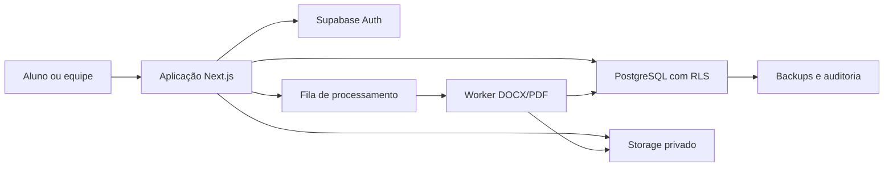
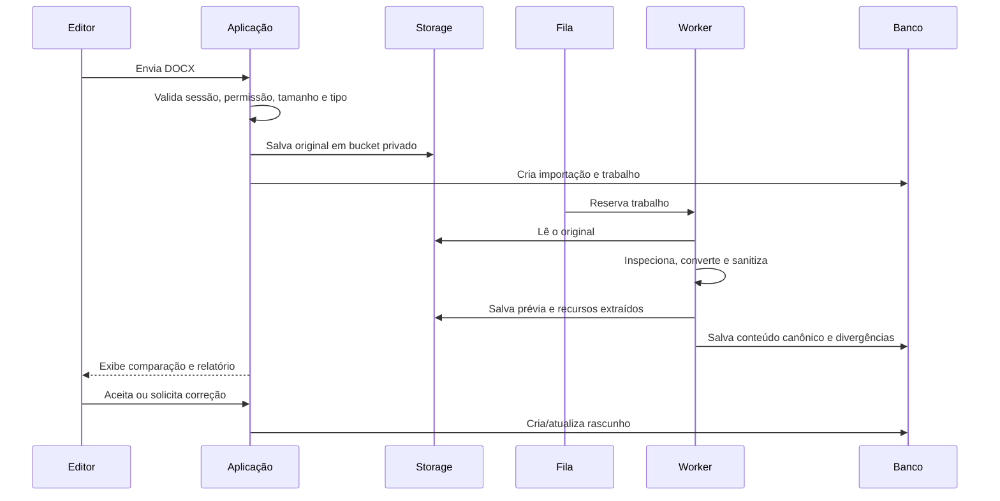

# MAC — Plataforma de Lei Seca

## Parte 2 — Arquitetura técnica, banco de dados e segurança

**Versão:** 1.0  
**Status:** Proposta técnica para aprovação  
**Base funcional:** `01-regras-de-negocio.md`

---

## 1. Decisão executiva

A plataforma será uma aplicação web moderna, dividida em quatro partes:

1. **Aplicação web:** interface do aluno e painel administrativo;
2. **Banco e autenticação:** usuários, leis, versões, permissões e dados de estudo;
3. **Armazenamento privado:** DOCX originais, imagens e arquivos exportados;
4. **Processador de documentos:** importação de DOCX e geração de DOCX/PDF.

Tecnologias recomendadas:

- **Next.js com TypeScript:** aplicação web e operações de servidor;
- **Supabase/PostgreSQL:** banco, autenticação e armazenamento;
- **Worker de documentos em Python:** conversão, inspeção e geração de DOCX/PDF;
- **Editor estruturado baseado em TipTap/ProseMirror:** edição controlada das leis;
- **Hospedagem da aplicação:** Vercel;
- **Hospedagem do worker:** serviço com processo persistente e LibreOffice disponível, como Railway, Render ou Fly.io;
- **Monitoramento:** Sentry ou equivalente, além dos logs do provedor.

O projeto não terá limite técnico fixo de 200 leis. A estrutura proposta deve funcionar inicialmente com pelo menos 500 leis e crescer sem redesenho do produto.

---

## 2. Princípio do conteúdo canônico

### 2.1 Três representações, uma única versão

Cada versão de lei poderá possuir:

- **arquivo original:** DOCX enviado pela equipe, preservado sem alterações;
- **conteúdo canônico:** documento estruturado em JSON, usado como fonte editável da plataforma;
- **representação de leitura:** HTML sanitizado produzido a partir do conteúdo canônico;
- **arquivos derivados:** DOCX e PDF gerados sob demanda.

O HTML exibido no navegador não será o documento mestre e não será salvo diretamente como versão oficial.

### 2.2 Por que não usar apenas HTML

HTML não representa com fidelidade todos os recursos de um DOCX. Além disso, aceitar HTML livre aumenta o risco de conteúdo executável malicioso. Um modelo estruturado permite:

- controlar os tipos de blocos aceitos;
- distinguir texto oficial e conteúdo editorial;
- preservar âncoras de artigos e anotações;
- produzir HTML seguro;
- gerar DOCX e PDF de forma previsível;
- comparar versões;
- validar o conteúdo antes da publicação.

### 2.3 Limite honesto da fidelidade

Não existe garantia técnica universal de ida e volta perfeita para qualquer recurso possível do Microsoft Word. Macros, objetos OLE, SmartArt, campos complexos, fontes indisponíveis e certos recursos de revisão podem não possuir equivalente web.

Por isso, a plataforma adotará um **perfil DOCX suportado**. Dentro desse perfil, a fidelidade será requisito testado. Fora dele, o sistema nunca descartará conteúdo silenciosamente: preservará o original e emitirá divergência para revisão.

---

## 3. Visão da arquitetura



### 3.1 Aplicação Next.js

Responsável por:

- telas e navegação;
- renderização do leitor;
- sessões autenticadas;
- validação de entrada;
- criação de URLs temporárias para arquivos autorizados;
- operações administrativas de servidor;
- acompanhamento de importações e exportações;
- comunicação com o worker por fila.

Será utilizado o App Router. Route Handlers e funções de servidor serão considerados interfaces públicas e deverão validar autenticação, autorização e dados recebidos em cada operação.

### 3.2 Supabase

Responsável por:

- autenticação;
- PostgreSQL;
- políticas Row Level Security;
- armazenamento de arquivos;
- eventos em tempo real apenas onde agregarem valor;
- backups conforme o plano contratado.

### 3.3 Worker de documentos

Responsável por tarefas pesadas ou demoradas:

- verificar DOCX;
- extrair estrutura, estilos, imagens e metadados;
- gerar o conteúdo canônico;
- produzir prévia em PDF/imagens;
- comparar renderizações;
- gerar DOCX editável;
- gerar PDF;
- registrar avisos, erros e métricas da conversão.

O worker não será executado no navegador. Ele também não dependerá do limite curto de execução típico de funções serverless.

---

## 4. Ambientes

Devem existir pelo menos três ambientes isolados:

- **Desenvolvimento:** dados fictícios e testes locais;
- **Homologação:** validação da equipe com cópias anonimizadas;
- **Produção:** alunos e dados reais.

Cada ambiente terá:

- projeto Supabase próprio;
- chaves próprias;
- buckets próprios;
- domínio próprio;
- banco próprio;
- configuração de e-mail própria.

Dados reais de produção não devem ser copiados diretamente para desenvolvimento.

---

## 5. Organização do projeto

Estrutura inicial recomendada:

```text
plataforma-lei-seca/
├── apps/
│   ├── web/                 # Next.js
│   └── document-worker/     # Python, DOCX e PDF
├── packages/
│   ├── content-schema/      # esquema do conteúdo canônico
│   ├── permissions/         # regras compartilhadas
│   ├── ui/                  # componentes visuais
│   └── validation/          # contratos de entrada e saída
├── supabase/
│   ├── migrations/          # estrutura do banco
│   ├── seed/                # somente dados fictícios
│   └── tests/               # testes de RLS e funções
├── docs/
├── tests/
└── .github/workflows/
```

Será um monorepositório para manter aplicação, worker, esquema de conteúdo e migrações na mesma versão.

---

## 6. Modelo de identidade e acesso

### 6.1 Autenticação

O Supabase Auth continuará sendo utilizado. O login visível poderá usar nome de usuário, mas a transformação para o identificador interno deve ocorrer no servidor, sem permitir enumeração de contas.

Recomendação preferencial:

- armazenar e-mail real de recuperação quando autorizado;
- permitir login por nome de usuário;
- exigir MFA para Administradores;
- permitir revogação de sessões;
- não usar senha conhecida pelo administrador.

### 6.2 Papéis

Papéis iniciais:

- `admin`;
- `editor`;
- `student`.

O papel efetivo será armazenado em campo controlado pelo servidor e confirmado no banco. Dados que o próprio usuário pode modificar não serão usados para conceder permissões.

### 6.3 Estado efetivo de acesso

O acesso será calculado por:

```text
autenticado
E status = ativo
E início_acesso <= agora
E expiração_acesso >= agora
E conta não bloqueada
```

Essa regra será centralizada em função do banco, por exemplo `has_active_access()`, utilizada pelas políticas RLS. A interface apenas refletirá o resultado; não decidirá a autorização.

---

## 7. Modelo de banco de dados

Todos os identificadores principais usarão UUID. Datas de evento usarão `timestamptz`. Horários serão gravados em UTC e apresentados em `America/Fortaleza`.

### 7.1 Usuários e organização

#### `profiles`

- `id` — vínculo com o usuário autenticado;
- `full_name`;
- `username_normalized` — único;
- `role` — admin, editor ou student;
- `status`;
- `access_starts_at`;
- `access_expires_at`;
- `must_change_password`;
- `created_at`, `updated_at`;
- `created_by`, `updated_by`.

#### `cohorts`

Representa turma, grupo ou produto de acesso.

- `id`, `name`, `status`;
- datas de início e fim opcionais;
- configurações de acesso;
- datas e autores.

#### `cohort_members`

- `cohort_id`;
- `profile_id`;
- período e situação da associação;
- restrição única por associação ativa.

#### `entitlements`

Permissões de conteúdo atribuídas diretamente ou por turma.

- beneficiário: usuário ou turma;
- escopo: acervo, matéria ou lei;
- início e expiração;
- situação.

Essa tabela pode permanecer preparada e ser usada somente se houver acervos diferentes por turma.

### 7.2 Catálogo

#### `subjects`

- `id`, `name`, `slug`;
- `display_order`;
- `status`.

#### `laws`

- `id` — identidade imutável;
- `norm_type`, `norm_number`, `norm_year`;
- `jurisdiction`;
- `short_title`, `official_title`, `summary`;
- `current_slug`;
- `primary_subject_id`;
- `editorial_status`;
- `display_order`;
- `official_source_url`;
- `last_verified_at`;
- `current_published_version_id`;
- datas e autores;
- `archived_at`, `archived_by`.

Restrição de possível duplicidade por tipo, número, ano e jurisdição.

#### `law_slugs`

Mantém slugs atuais e antigos para não quebrar links.

- `law_id`;
- `slug` único;
- `is_current`;
- data de criação.

#### `law_subjects` e `tags`

Relacionam matérias secundárias e classificações adicionais.

### 7.3 Versionamento

#### `law_versions`

- `id`, `law_id`;
- `version_number`;
- `status` — draft, review, published, superseded, rejected;
- `content_schema_version`;
- `canonical_content` — JSONB validado;
- `sanitized_html` — cache derivado, nunca fonte primária;
- `plain_text` — busca e comparação;
- `source_import_id`;
- `based_on_version_id`;
- `change_summary`;
- `created_by`, `created_at`;
- `submitted_at`, `submitted_by`;
- `published_at`, `published_by`;
- hash do conteúdo.

Restrições:

- número de versão único por lei;
- versão publicada imutável;
- somente uma versão indicada como vigente em `laws`;
- mudança de vigente feita por função transacional.

#### `law_nodes`

Índice estrutural derivado da versão:

- `id` estável do dispositivo;
- `version_id`, `law_id`;
- tipo: artigo, parágrafo, inciso etc.;
- rótulo e caminho hierárquico;
- ordem;
- texto normalizado;
- hash de conteúdo;
- referência ao nó anterior da versão precedente.

Essa estrutura sustenta índice, links, busca e migração de anotações.

#### `change_reports`

- `law_id`, `version_id`;
- data de referência;
- tipo da alteração;
- descrição pública;
- dispositivos relacionados;
- situação e autoria.

### 7.4 Importação e arquivos

#### `document_imports`

- `id`, `law_id` opcional;
- `original_file_id`;
- finalidade: nova lei ou atualização;
- status;
- versão do importador;
- opções de conversão;
- resumo de resultados;
- quantidade de avisos e erros;
- usuário e datas.

#### `import_issues`

- `import_id`;
- severidade: info, warning, critical;
- código;
- localização no documento;
- descrição;
- estado de resolução;
- decisão e responsável.

#### `files`

- metadados do arquivo;
- bucket e caminho interno;
- nome original;
- tipo declarado e detectado;
- tamanho;
- hash SHA-256;
- proprietário lógico;
- retenção;
- datas.

O banco guarda metadados; o binário permanece no Storage.

### 7.5 Dados pessoais de estudo

#### `annotations`

- `id`, `student_id`, `law_id`;
- `created_on_version_id`;
- `node_stable_id`;
- tipo;
- conteúdo estruturado;
- texto selecionado;
- contexto anterior e posterior;
- offsets aproximados;
- estado da âncora;
- datas e exclusão lógica.

#### `favorites`

- usuário, lei, dispositivo opcional e comentário;
- restrição contra favorito duplicado.

#### `reading_progress`

- usuário e lei;
- versão vista;
- último dispositivo;
- percentual aproximado;
- data do último acesso.

#### `user_preferences`

- preferências de leitura e acessibilidade por usuário.

### 7.6 Exportações e processamento

#### `document_jobs`

Fila de trabalhos:

- tipo: import, render-preview, export-docx, export-pdf;
- solicitante;
- lei e versão;
- opções;
- status: queued, processing, succeeded, failed, cancelled;
- prioridade, tentativas e datas;
- mensagem segura de erro;
- worker responsável.

#### `document_exports`

- `job_id`, `law_id`, `version_id`;
- formato;
- opções de exportação;
- arquivo gerado;
- versão do modelo;
- expiração do arquivo;
- solicitante e data.

### 7.7 Auditoria

#### `audit_log`

- autor;
- ação;
- objeto e identificador;
- resultado;
- antes e depois em formato filtrado;
- data;
- identificador de requisição;
- dados técnicos mínimos para investigação.

Senhas, tokens, chaves, conteúdo integral de anotações e arquivos não devem ser copiados para auditoria.

---

## 8. Matriz de acesso

| Recurso | Aluno | Editor | Administrador |
|---|---|---|---|
| Próprio perfil | Ler dados permitidos | Ler próprios dados | Gerenciar perfis |
| Perfil de outro aluno | Não | Não | Gerenciar |
| Catálogo permitido | Ler | Ler e editar | Gerenciar |
| Versão publicada | Ler | Ler | Ler |
| Rascunhos | Não | Ler e editar | Gerenciar |
| Publicar | Não | Configurável | Sim |
| Anotação pessoal | Somente a própria | Somente a própria | Somente a própria pela interface comum |
| Favoritos e progresso | Somente os próprios | Somente os próprios | Somente os próprios |
| DOCX original | Não | Conforme lei autorizada | Sim |
| Exportação | Conforme configuração | Sim | Sim |
| Auditoria | Não | Ações próprias limitadas | Ler |
| Gestão de usuários | Não | Não | Sim |

---

## 9. Políticas RLS

### 9.1 Regras gerais

- RLS será ativada em todas as tabelas expostas pela API.
- Ausência de política significa acesso negado.
- Funções auxiliares de autorização ficarão em schema não exposto.
- Papéis e validade nunca serão lidos de metadados editáveis pelo próprio usuário.
- Toda política combinará identidade autenticada, papel, validade e escopo de conteúdo.

### 9.2 Exemplos conceituais

#### Anotações

```text
SELECT/INSERT/UPDATE/DELETE permitido quando:
student_id = auth.uid()
E has_active_access()
```

No `INSERT`, o banco deve exigir que `student_id` seja o usuário autenticado, ignorando qualquer tentativa de informar outro proprietário.

#### Versões de lei

```text
Aluno pode ler quando:
status = published
E versão = laws.current_published_version_id
E has_active_access()
E has_content_entitlement(law_id)
```

Editor e Administrador terão políticas separadas. Publicação não será feita por atualização direta comum.

#### Arquivos

Buckets serão privados. Download ocorrerá por URL assinada curta, criada somente após autorização. Conhecer o caminho de um arquivo não dará acesso ao conteúdo.

### 9.3 Testes obrigatórios

Cada migração de RLS deverá testar:

- usuário anônimo;
- aluno ativo;
- aluno expirado;
- aluno desativado;
- aluno tentando trocar o próprio identificador;
- aluno tentando acessar outro aluno;
- editor;
- administrador;
- sessão com papel alterado recentemente.

---

## 10. Operações privilegiadas

As seguintes ações ocorrerão exclusivamente no servidor:

- criar usuário;
- gerar convite e redefinição administrativa;
- alterar papel, validade ou situação;
- revogar sessões;
- publicar versão;
- arquivar ou restaurar lei;
- gerar URL de arquivo original;
- iniciar exportação;
- concluir trabalhos do worker;
- exclusão definitiva.

A chave administrativa do Supabase ficará somente em ambiente seguro do servidor/worker. Ela nunca será incluída no JavaScript enviado ao navegador.

Mesmo usando chave administrativa, o código deverá verificar explicitamente o usuário solicitante e registrar auditoria.

---

## 11. Publicação transacional

A publicação será implementada como função transacional no PostgreSQL.

Fluxo:

1. validar usuário e permissão;
2. bloquear logicamente a lei durante a operação;
3. confirmar que o rascunho pertence à lei e está em revisão;
4. validar esquema, conteúdo e pendências críticas;
5. atribuir o próximo número da versão;
6. tornar a nova versão imutável e publicada;
7. marcar a versão anterior como substituída;
8. atualizar `current_published_version_id`;
9. criar relatório e auditoria;
10. confirmar tudo em um único commit.

Qualquer erro desfaz toda a operação. Nunca haverá intervalo em que uma lei publicada fique sem versão vigente.

---

## 12. Fluxo de importação DOCX



### 12.1 Pipeline técnico

1. Validar assinatura ZIP/OOXML, não apenas extensão.
2. Rejeitar arquivo criptografado, corrompido ou acima do limite.
3. Inspecionar conteúdo e relacionamento entre partes do DOCX.
4. Extrair estilos, parágrafos, runs, tabelas, imagens, hyperlinks e notas.
5. Mapear estilos conhecidos para blocos jurídicos/editoriais.
6. Converter para o esquema canônico.
7. Sanitizar URLs, texto e recursos.
8. Registrar elementos sem suporte.
9. Gerar HTML seguro de leitura.
10. Renderizar prévia comparável ao original.

### 12.2 Bibliotecas candidatas

- `python-docx` e manipulação OOXML para leitura/gravação controlada;
- LibreOffice em modo headless para renderização de referência e PDF;
- parser XML seguro;
- ferramenta especializada adicional caso os testes mostrem lacunas.

A escolha final será feita por uma prova de conceito com documentos reais da MAC, não apenas por comparação de listas de recursos das bibliotecas.

---

## 13. Fluxo de exportação DOCX/PDF

1. Usuário escolhe lei, versão, formato e opções.
2. Servidor valida acesso à versão e às anotações solicitadas.
3. Cria trabalho assíncrono.
4. Worker lê o conteúdo canônico imutável.
5. Aplica o modelo institucional versionado.
6. Gera DOCX verdadeiro com OOXML.
7. Renderiza o DOCX para verificação.
8. Para PDF, converte pelo mesmo pipeline visual.
9. Valida abertura, quantidade de páginas, fontes, imagens e estrutura mínima.
10. Salva arquivo em bucket privado com expiração.
11. Usuário recebe link temporário autorizado.

### 13.1 Coerência entre DOCX e PDF

O DOCX será o primeiro artefato exportado. O PDF será derivado do mesmo conteúdo e modelo, preferencialmente pela renderização do DOCX em ambiente controlado. Isso reduz diferenças entre os formatos.

### 13.2 Fontes

As fontes usadas pela identidade visual devem possuir licença que permita uso no servidor e incorporação quando aplicável. Fontes substituídas podem alterar paginação; por isso, o ambiente do worker terá conjunto fixo e versionado de fontes.

---

## 14. Busca e desempenho

### 14.1 Catálogo

Ao entrar, a aplicação carregará somente metadados paginados. O texto de uma lei será carregado quando ela for aberta.

### 14.2 Busca textual

O PostgreSQL utilizará busca textual com:

- coluna `tsvector` gerada;
- índice GIN;
- pesos maiores para título, número e rótulo do dispositivo;
- função de busca com ranking;
- filtros por matéria, tipo, ano e situação.

Inicialmente não será necessário contratar um buscador externo. Essa decisão poderá ser revista com métricas reais.

### 14.3 Cache

- Conteúdo publicado pode usar cache por versão imutável.
- Rascunhos, dados pessoais e decisões de acesso não terão cache público.
- Publicação invalida apenas catálogo, lei e buscas afetadas.
- Arquivos privados nunca serão expostos por CDN pública sem autorização temporária.

---

## 15. Segurança do conteúdo web

- A interface renderizará somente elementos previstos no esquema canônico.
- HTML derivado será sanitizado no servidor.
- Não serão permitidos scripts, iframes, formulários, eventos HTML ou CSS arbitrário.
- URLs aceitarão protocolos e destinos permitidos.
- Imagens serão servidas de armazenamento controlado.
- Será configurada Content Security Policy.
- Cookies de sessão usarão atributos seguros adequados.
- Operações de escrita validarão origem e proteção contra requisições indevidas.
- Dependências terão verificação automática de vulnerabilidades.

---

## 16. Observabilidade e tratamento de erros

Serão registrados:

- erros da aplicação;
- falhas de banco;
- duração e resultado de importações/exportações;
- fila e número de tentativas;
- divergências por tipo de documento;
- tentativas administrativas recusadas;
- taxa de falha de login, sem registrar senha;
- desempenho de leitura e busca.

Cada requisição e trabalho terá um identificador de correlação. Mensagens apresentadas ao usuário serão claras, mas não revelarão detalhes internos ou segredos.

---

## 17. Backup, retenção e recuperação

- Produção deverá usar plano com backup automático compatível com o risco do negócio.
- Antes do lançamento será definido o ponto máximo aceitável de perda de dados e o tempo de recuperação.
- DOCX originais terão política de retenção longa.
- Exportações temporárias poderão expirar e ser eliminadas por rotina agendada.
- Backups lógicos externos periódicos serão considerados para reduzir dependência de um único provedor.
- Restauração será testada em ambiente isolado.
- Exclusão do projeto Supabase será protegida por controles administrativos e procedimento documentado.

---

## 18. Integração e entrega contínua

Cada alteração deverá passar por:

1. formatação e análise estática;
2. testes unitários;
3. testes de banco e RLS;
4. testes de integração;
5. teste de build;
6. verificação de dependências;
7. implantação em homologação;
8. aprovação para produção.

Migrações de banco serão versionadas no repositório. Alterações manuais diretamente no banco de produção deverão ser excepcionais e posteriormente registradas como migração.

---

## 19. Testes obrigatórios de documentos

Será criado um acervo de referência contendo, no mínimo:

- lei simples;
- lei longa;
- documento com muitos grifos;
- tabelas com células mescladas;
- caixas editoriais;
- imagens;
- hyperlinks e notas;
- listas e recuos;
- quebras de página;
- caracteres especiais;
- documento com recurso não suportado.

Para cada arquivo serão verificados:

- DOCX original versus prévia importada;
- conteúdo importado versus DOCX exportado;
- DOCX exportado versus PDF;
- ausência de perda silenciosa;
- relatório correto de divergências;
- abertura no Microsoft Word;
- renderização do PDF;
- estabilidade entre versões do conversor.

Arquivos considerados padrão-ouro serão mantidos no conjunto de testes para evitar regressões.

---

## 20. Fases de implementação técnica

### Fase A — fundação

- monorepositório;
- ambientes;
- autenticação;
- schema inicial;
- RLS e testes;
- catálogo e leitor básico;
- auditoria.

### Fase B — conteúdo editorial

- conteúdo canônico;
- editor estruturado;
- leis, rascunhos e publicação transacional;
- índice de dispositivos;
- busca.

### Fase C — documentos

- prova de conceito com DOCX reais;
- worker e fila;
- importação, prévia e divergências;
- DOCX/PDF exportados;
- testes visuais.

### Fase D — estudo pessoal

- anotações com âncoras estáveis;
- favoritos;
- progresso;
- preferências.

### Fase E — preparação para lançamento

- desempenho com massa representativa;
- segurança;
- backup e restauração;
- acessibilidade;
- piloto controlado;
- monitoramento e suporte.

---

## 21. Decisões técnicas aprovadas por esta proposta

Se este documento for aceito, ficam definidas:

1. Next.js e TypeScript para a aplicação;
2. Supabase para Auth, PostgreSQL e Storage;
3. RLS como barreira obrigatória, não apenas interface;
4. worker separado para DOCX/PDF;
5. conteúdo canônico estruturado em JSON;
6. HTML apenas como representação sanitizada;
7. DOCX original sempre preservado;
8. publicação transacional;
9. arquivos privados com acesso temporário;
10. monorepositório com migrações e testes versionados.

---

## 22. Decisões ainda necessárias

Antes de iniciar a implementação completa, será preciso confirmar:

1. Vercel + Railway/Render/Fly.io ou outro conjunto de hospedagem;
2. limite de tamanho dos DOCX;
3. fontes institucionais e respectivas licenças;
4. recursos do Word considerados obrigatoriamente suportados;
5. prazo de retenção de exportações;
6. exportação liberada ou não para todos os alunos;
7. necessidade de turmas e acervos diferentes já no MVP;
8. Editor publica diretamente ou envia para aprovação;
9. e-mail real para recuperação de conta;
10. orçamento mensal inicial de infraestrutura.

---

## 23. Referências oficiais consultadas

- Supabase — Row Level Security: https://supabase.com/docs/guides/database/postgres/row-level-security
- Supabase — Full Text Search: https://supabase.com/docs/guides/database/full-text-search
- Supabase — Database Backups: https://supabase.com/docs/guides/platform/backups
- Supabase — Securing Edge Functions: https://supabase.com/docs/guides/functions/auth
- Supabase — Cron: https://supabase.com/docs/guides/cron
- Next.js — App Router: https://nextjs.org/docs/app
- Next.js — Route Handlers: https://nextjs.org/docs/app/getting-started/route-handlers
- Next.js — `use server`: https://nextjs.org/docs/app/api-reference/directives/use-server

