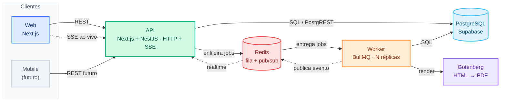

# Arquitetura de execução (stack) — Plataforma de Simulados

> **Mapa dos processos em execução** e como se comunicam. Complementa o **modelo de dados**
> (tabelas `simulado_*`, prefixo compartilhado com `mentoria_*` no mesmo banco) e o **roadmap de fases**
> (ver memória `roadmap-arquitetura-api` + `RUNBOOK-ROLLOUT.md`).
> Tudo sobe via **docker-compose** (dev) → **Portainer** (prod). O alvo do roadmap (API dedicada,
> Postgres direto, SSE) **já foi construído** e liga por **flags/envs** — sem elas, roda como antes.
> Última revisão: 2026-07-22.

---

## 1. Visão geral

SaaS **multitenant e multiusuário** para **simulados e questões de concurso**. Cada cliente
(ex.: Revisão / Ensino Jurídico) é um **tenant**, resolvido por **subdomínio**. Áreas:

- **Portal do aluno** (`/aluno/*`) — faz simulados, vê resultados.
- **Painel admin** (`/admin/*`) — conteúdo, simulados, alunos/grupos/matrículas, relatórios, integrações, RBAC, auditoria.
- **Área embedável** (`/embed/*`, `/api/auth/embed/*`) — resolução de prova dentro de iframe/LMS, com login leve (e-mail / +CPF / +telefone), sem senha.

## 2. Mapa da stack

**Legenda:** linha cheia = requisição/dado; linha tracejada = **tempo real** (SSE / pub-sub).
O **Worker nunca fala direto com o navegador** — publica no Redis e a camada web empurra por **SSE**
(com *fallback* automático para polling quando não há Redis/proxy com SSE).

### Processos e responsabilidades

| Processo | Papel | Escala |
|---|---|---|
| **Web** (Next.js 15 · `apps/web`) | UI + SSR + Server Actions + Route Handlers `/api/*`. Faz hoje o **papel de API**: auth/RBAC, SSE do "ao vivo", enfileira jobs, expõe `/api/cron/*` e `/api/internal/*`. | por réplicas atrás do proxy |
| **API** (NestJS · `apps/api`) | Serviço **dedicado de relatórios** com **Postgres direto** (`/v1/relatorios/*`, `/health`, `/metrics`). Entra por **strangler**, atrás da flag `RELATORIOS_API_URL`; se cair, o web volta pro SQL local → PostgREST. | N réplicas (stateless) |
| **Mobile** (futuro) | mesmo backend (REST/SSE) — nada muda no servidor (`NEXT_PUBLIC_API_URL` já reservado). | — |
| **Worker** (BullMQ · `apps/worker`) | Processa **jobs pesados** (PDF, imports, re-correção em lote) **e** roda o **agendador de crons**. Separado do web. | **N réplicas** — o BullMQ distribui |
| **PostgreSQL** | Dado relacional — **Supabase gerenciado**. Tabelas `simulado_*` com `tenant_id` + RLS. Acesso por **PostgREST (HTTP, padrão)** e **Postgres direto** (`pg` via pooler, relatórios, atrás de flag). | 1 (HA gerenciado) |
| **Redis** | **fila** BullMQ + **pub/sub** do realtime + **cache** de relatórios + rate-limit. | 1 (cluster em prod) |
| **Gotenberg** | render **HTML → PDF** (chamado pelo Worker; sobe no Storage do Supabase). | N réplicas |
| **nginx / Traefik** | proxy + TLS + roteamento por subdomínio. Em prod: **Traefik/Portainer**. | — |

> **Estado atual (strangler):** o caminho **padrão** é `Web (Next.js) → PostgREST → Supabase`, com
> realtime por **SSE** e jobs no **Worker**. As peças "à frente" do roadmap ligam por env, uma a uma:
> `REPORT_SQL`/`DATABASE_URL` (Postgres direto nos relatórios), `RELATORIOS_API_URL` (serviço `api`),
> `DATABASE_URL_REPLICA` (read-replica). Detalhes em `RUNBOOK-ROLLOUT.md`.

Monorepo **pnpm workspaces + Turborepo**: `apps/web`, `apps/api`, `apps/worker`, `packages/*`
(`shared`, `config`, `data` — SQL/pool compartilhado entre `web` e `api`).

## 3. Multitenancy

- Toda tabela de negócio tem `tenant_id` e prefixo **`simulado_`** (o banco é compartilhado com outro produto `mentoria_*`).
- **Resolução por subdomínio**: `lib/tenant.ts` (`getCurrentTenant`) lê o host → `simulado_tenants.slug` (via `createAdminClient`, que bypassa RLS).
- **Isolamento** hoje é feito **na aplicação**: quase todo acesso usa `createAdminClient()` (service-role, RLS bypassado) + filtro explícito `.eq('tenant_id', ...)`. O RLS existe no banco, mas o código não depende dele para isolar. **Regra de ouro: nunca uma query sem `tenant_id`.**
- Um usuário (e-mail) pode ter acesso a vários tenants com papéis diferentes via `simulado_tenant_acessos`.

## 4. Autenticação e RBAC

- **Dupla autenticação:**
  - **Admins**: Supabase Auth (`createClient` / cookies de sessão). `lib/auth/permissions.ts` (`getCurrentAccess`) resolve papel + permissões (papéis `admin`/`super_admin`/`admin_geral` dão acesso total; demais resolvem a matriz).
  - **Alunos (embed)**: JWT próprio httpOnly (`lib/aluno-session.ts`, cookie CHIPS/Partitioned p/ iframe cross-site). Emitido após identidade + regras (matrícula/janela/prazo/tentativas/testador).
- **RBAC**: `simulado_roles`/`permissions`/`role_permissions`/`tenant_acessos`. Enforcement por `checkPermission('resource:action')` no início de cada action/rota + `useCan()` na UI. Gestão de **administradores** e **cargos** em `/admin/administradores` (abas *Administradores* × *Permissões*).
- **Auditoria**: `lib/audit.ts` (`registrarAudit`) grava em `simulado_audit_logs` (INSERT/UPDATE/DELETE/LIBERAR/BLOQUEAR/ANULAR/RECORRIGIR/LOGIN…) com ator/tenant/diff. Best-effort (nunca quebra a operação).

## 5. Camada de dados

- **Padrão**: as `actions.ts` e route handlers montam queries **PostgREST diretas** (`@supabase/supabase-js`). Teto de ~1000 linhas/resposta → helper `lib/supabase/fetch-all.ts` (`fetchAll`/`fetchAllByIn`) pagina em loop.
- **Postgres direto (roadmap Fase 1)**: `packages/data` expõe um **pool `pg`** (via pooler do Supabase) e as queries SQL dos relatórios. Ligado por `DATABASE_URL` + `REPORT_SQL` (`shadow` valida sem servir; vazio/`on` serve; `off` volta pro PostgREST). Ganho medido de **9×–48×** em relatórios pesados.
- Clientes Supabase: `createAdminClient()` (service-role, sem RLS — padrão para operações confiáveis) e `createClient()`/`createServiceClient()` (com cookies de sessão).

## 6. Engine de simulados (núcleo)

- **Sessão de prova** (`simulado_sessoes_prova`): status `aguardando/em_andamento/finalizada`, `is_teste` (testadores — fora de stats/ranking), tentativa, nota, ranking.
- **Embaralhamento determinístico** por sessão (`simulado_sessao_questao_ordem`): seed → Fisher-Yates, persistido, nunca recalculado.
- **Auto-save idempotente** de respostas: `POST /api/sessoes/resposta` faz upsert por (sessão, questão) — suporta muitos alunos simultâneos.
- **Validação tripla** a cada acesso: sessão é do aluno, não finalizada, dentro do tempo/janela.
- **Modos de aplicação**: `janela_fixa` (data início/fim globais), `prazo_relativo` (acesso avulso com prazo por aluno), `aberto`.
- **Auto-encerramento** (`/api/cron/encerrar-expirados`, a cada 60 s pelo worker): finaliza janelas expiradas + sessões com tempo estourado, em lote (leitura de acertos + finalização paralela + eventos num insert; idempotente por `status='em_andamento'`).

## 7. Re-correção (anulação / troca de gabarito) — assíncrona

Quando uma questão é anulada ou tem o gabarito trocado após respostas:

- Lógica canônica única em `lib/simulado/recorrecao.ts` (`executarRecorrecao`): recalcula nota (`lib/simulado/nota.ts`), ranking (`lib/ranking.ts`) e grava impacto **antes × depois** por aluno (`simulado_recorrecoes` / `simulado_recorrecao_impactos`).
- **Híbrido por tamanho**: ≤ `RECORRECAO_SYNC_MAX` (200) sessões → roda **inline** (resultado na hora); acima → **enfileira** na fila BullMQ `re-correcao`. O worker chama `POST /api/internal/recorrecao` (protegido por `CRON_SECRET`), que roda a MESMA função — **zero duplicação de regra**. Sem Redis, cai para inline.
- Idempotente (guards marcam `jaAplicado` → retry não corrompe).

## 8. Relatórios — cacheados + SQL direto

- Loaders em `app/admin/relatorios/**/_dados.ts` + `_resumos.ts` (por simulado, estudante, disciplina, gráficos, ranking).
- **Cache Redis** (`lib/cache/relatorio-cache.ts`): memoiza por tenant (TTL 10 min), invalidado por evento (encerramento, re-correção, import). Degrada sozinho sem Redis.
- **Fonte de dados** por prioridade (strangler): **API dedicada** (`RELATORIOS_API_URL`) → **SQL direto local** (`REPORT_SQL`) → **PostgREST**. Cada camada faz *fallback* pra próxima. Índices em `simulado_respostas_objetivas(questao_id)` aceleram o cache-miss.

## 9. Realtime (SSE + Redis pub/sub)

- **Painel "Ao vivo"** e **board "fazendo agora"**: `EventSource` no cliente → rotas SSE `app/api/stream/ao-vivo/[simuladoId]` e `app/api/stream/online` → assinam canais Redis (`lib/realtime/pubsub.ts`).
- Publicação nos pontos de mutação de sessão; *debounce* + baseline periódico + heartbeat. **Fallback automático para polling** (10–12 s) quando não há Redis/SSE no proxy.

## 10. Integrações (entrada de alunos) e imports

- **Guru** (pagamento): webhook `POST /api/webhooks/guru/[token]` valida HMAC, grava evento (idempotente por `event_id`) e aplica entitlement inline. Retentativa via `/api/cron/integracoes-eventos`.
- **Curseduca** (LMS): webhook `POST /api/webhooks/curseduca/[token]` **enfileira** um job (`simulado_curseduca_jobs`) e responde 202 — o cron `/api/cron/curseduca-jobs` processa em background. Sync automática via `/api/cron/curseduca-sync`.
- **Webhook genérico** `/api/webhooks/in/[token]`: receptor puro → inbox `simulado_webhook_inbox` → processado depois.

## 11. Jobs, filas e crons

- **Filas BullMQ** (`apps/worker/src/main.ts`): `pdf-relatorio`, `pdf-caderno`, `import`, `re-correcao`. Produtores no web: `lib/queue/pdf-queue.ts`, `lib/queue/recorrecao-queue.ts`.
- **Agendador**: o worker roda `setInterval` chamando rotas de cron do web (idempotentes, `x-cron-secret`):
  `encerrar-expirados` (60 s), `curseduca-jobs` (60 s), `curseduca-sync` (60 s), `integracoes-eventos` (60 s), `sincronizar-grupos-bancos` (180 s, self-healing grupo→banco), `warm-cache` (300 s, pré-aquece relatórios).
- **PDF**: `POST /api/pdf/gerar` enfileira → worker renderiza `/imprimir/...` via Gotenberg → sobe no Storage → link por notificação. Mala-direta em massa segue esse caminho (assíncrono).

## 12. Cadernos / mala-direta

- Editor de blocos (`components/admin/caderno-editor-v2.tsx`) monta modalidades (Diagnóstico, Folha de respostas, Caderno completo…). Config em `simulado_cadernos_designer.config` (jsonb: `docsV2`, `modalidadesV2`).
- **Merge** (`lib/caderno-designer/merge.ts`) resolve variáveis por aluno (desempenho por disciplina/pilar). Preview no editor com limite; render em massa no worker (via `/imprimir` + Gotenberg).
- **Pastas** de Banco / Aplicação de Simulado / Cadernos vivem todas em `simulado_pastas`, distinguidas por `folder_area` (`banco` / `simulado` / `caderno`).

## 13. White-label por tenant

- `simulado_tenants.tema` (jsonb: logo, cores, fonte) injetado como CSS variables no `:root` conforme o subdomínio → marca por tenant, combinada com dark/light/system (next-themes). Sem rebuild por cliente.

## 14. Modelo de dados (resumo)

Tabelas com prefixo `simulado_` (todas com `tenant_id`, exceto globais como `simulado_tenants`, `simulado_users`, `simulado_tenant_acessos`). Grupos principais:

- **Núcleo/identidade**: `tenants`, `users`, `tenant_acessos`, `estudantes`, `matriculas`.
- **RBAC/auditoria/LGPD**: `roles`, `permissions`, `role_permissions`, `audit_logs`, `lgpd_*`.
- **Conteúdo**: `questoes`, `alternativas`, `disciplinas`, `assuntos`, `pastas` (bancos/pastas), `pasta_grupos`, `grupos`, `grupo_membros`.
- **Simulado/sessão**: `simulados`, `prova_questoes`, `sessoes_prova`, `sessao_questao_ordem`, `respostas_objetivas`, `sessao_eventos`, `acessos`, `testadores`.
- **Re-correção**: `recorrecoes`, `recorrecao_impactos`.
- **Integrações/jobs**: `integracao_config`, `integracao_eventos`, `webhook_inbox`, `curseduca_jobs`, `curseduca_sync`, `pdf_jobs`, `cadernos_designer`.

> ⚠️ Algumas FKs do esqueleto apontam para `simulado_users` (vazio) e são evitadas (ver memória `fks-esqueleto-quebradas`).

## 15. Deploy

- `docker-compose.yml`: `nginx`, `web`, `api`, `worker`, `redis`, `gotenberg` (Postgres é o Supabase gerenciado — **não** há Postgres local).
- Produção via **Portainer** (Traefik como proxy). Imagens: `ghcr.io/revisaoprojetos/plataforma_simulado:<sha>` (**web**) e `ghcr.io/revisaoprojetos/plataforma_simulado-worker:<sha>` (**worker** — o `-worker` faz parte do **nome**, não é sufixo do tag).
- Migrations SQL rodadas **manualmente** no SQL Editor do Supabase; o código é escrito **tolerante** (fallback quando a coluna/tabela ainda não existe).

## 16. Roadmap — o que já está pronto (atrás de flags)

Ordem de rollout e desligamento em `RUNBOOK-ROLLOUT.md`. Tudo reversível por env.

| Fase | Entrega | Liga por | Estado |
|---|---|---|---|
| 0 | Cache de relatórios, índices, auto-encerramento em lote, re-correção assíncrona, webhook Curseduca enfileirado | liga sozinho com Redis | ✅ ativo |
| 1 | **Postgres direto** nos relatórios (`packages/data`) | `DATABASE_URL` + `REPORT_SQL` | ✅ construído · valida em `shadow` |
| 2 | **Realtime SSE** (ao vivo + board) via Redis pub/sub | liga sozinho com Redis | ✅ ativo (fallback polling) |
| 3 | **API dedicada** (NestJS `apps/api`) para relatórios | `RELATORIOS_API_URL` + `API_INTERNAL_SECRET` | ✅ construído · opcional |
| 4 | Read-replica + warm-cache + `/metrics` | `DATABASE_URL_REPLICA` (warm-cache liga sozinho) | ✅ construído · opcional |

> O maior limitador de escala histórico era o **PostgREST** (round-trips + teto 1000 + sem pooling);
> a Fase 1 (Postgres direto via pooler) o endereça diretamente nos hotspots de relatório.
